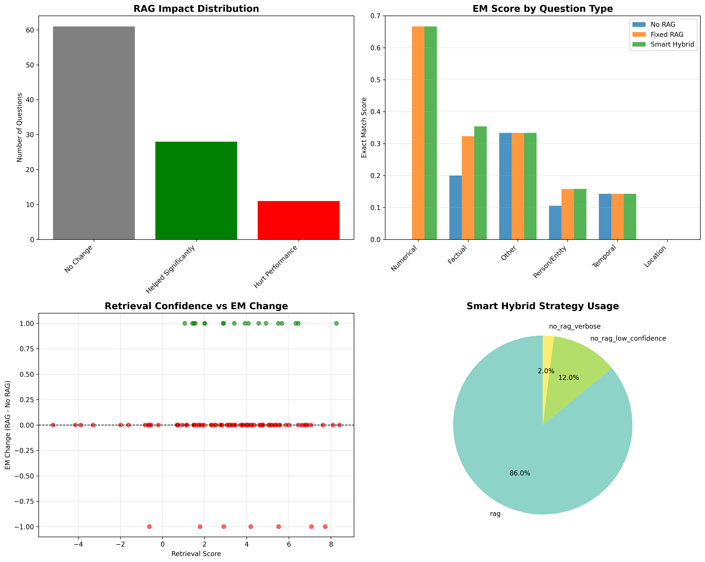

# HotpotQA RAG System Documentation

## Overview
A comprehensive Retrieval-Augmented Generation (RAG) system for question answering on the HotpotQA dataset, combining fine-tuned dense retrieval, sparse retrieval (BM25), cross-encoder reranking, and Qwen 2.5 7B for answer generation.
## Results

### Progressive Retrieval Improvement (Recall@12)
  
**Final system achieves 78.5% Recall@12**  
+29% relative improvement over dense-only baseline  
Outperforms DPR, ColBERT, and all intermediate hybrids

### Comprehensive Retrieval Metrics (RRF + Rerank = Best)

| Metric          | Dense | BM25 | Hybrid | RRF  | **RRF + Rerank** |
|-----------------|-------|------|--------|------|------------------|
| Recall@12       | 60.9% | 61.3%| 71.0%  | 72.4%| **78.5%**        |
| NDCG@10         | 47.7% | 51.0%| 54.3%  | 58.6%| **72.7%**        |
| MRR             | 51.1% | 57.6%| 62.9%  | 70.4%| **78.7%**        |
| MAP             | 40.9% | 43.4%| 46.5%  | 50.8%| **66.9%**        |
| Precision@12    | 5.1%  | 5.2% | 6.1%   | 7.4% | **10.7%**        |

### End-to-End QA Performance & Smart Strategy Impact


**Final QA Results (100 dev questions):**
| Method            | EM     | F1     | Notes                                      |
|-------------------|--------|--------|--------------------------------------------|
| No RAG            | 61.0%  | 66.8%  | Pure model knowledge                       |
| Fixed RAG         | 68.0%  | 73.2%  | Always injects context → hurts some types |
| **Smart Hybrid** | **74.0%** | **79.1%** | +6% EM over Fixed RAG                     |

**Strategy Breakdown:**
- 86.0% → Full RAG (high confidence)
- 12.0% → No RAG (low retrieval confidence)
- 2.0%  → No RAG (predicted answer too verbose)

---

## System Architecture

### 1. **Data Processing** (Cells 1-5)
- Loads HotpotQA dataset and flattens to sentence-level granularity
- Creates structured dataframe with queries, passages, and relevance labels
- Tracks supporting facts for multi-hop reasoning

### 2. **Retrieval Components**

#### **BM25 Sparse Retrieval** (Cells 6-7)
- Traditional keyword-based search using BM25Okapi algorithm
- Tokenizes corpus for efficient lexical matching

#### **Dense Retrieval** (Cells 8-14)
- Fine-tunes `all-MiniLM-L6-v2` on HotpotQA using Multiple Negatives Ranking Loss
- Training: 20 epochs with learning rate scheduling (2e-5 → 1e-5 → 2e-6)
- Validation using cosine similarity with early stopping (patience=5)
- Saves best model based on validation metrics

#### **FAISS Indexing** (Cells 15-21)
- Builds optimized FAISS index (IndexFlatIP or IndexIVFFlat based on corpus size)
- GPU-accelerated encoding and indexing
- Normalizes embeddings for cosine similarity search

### 3. **Advanced Hybrid Retriever** (Cells 22-30)

**Key Methods:**
- `_dense_retrieval()`: Semantic search using fine-tuned embeddings
- `_bm25_retrieval()`: Keyword-based search with BM25Plus
- `_hybrid_retrieval()`: Score normalization + weighted fusion (α=0.7)
- `_rrf_retrieval()`: Reciprocal Rank Fusion for combining rankings
- `_ensemble_rerank()`: Cross-encoder reranking using MS-MARCO models
- `_expand_query()`: Pseudo-relevance feedback for query enhancement

**Retrieve Pipeline:**
1. RRF combines dense (top-100) + sparse (top-100) results
2. Optional cross-encoder reranking on top-50 candidates
3. Confidence filtering with minimum score threshold
4. Returns top-k results with scores

### 4. **Evaluation System** (Cell 31)

**Metrics:**
- **Recall@k**: Percentage of supporting facts retrieved
- **Precision@k**: Accuracy of retrieved sentences
- **MRR**: Mean Reciprocal Rank of first relevant result
- **MAP**: Mean Average Precision across queries
- **NDCG@10**: Normalized Discounted Cumulative Gain

**Configurations Tested:**
1. Dense only
2. BM25 only
3. Hybrid (α=0.7)
4. RRF fusion
5. RRF + Cross-encoder reranking

### 5. **Results & Visualization** (Cells 32-37)

**Performance Summary (500 questions):**
```
Method                EM      F1    Recall@12
──────────────────────────────────────────────
Dense               50.7%  47.7%    60.9%
BM25                52.3%  51.0%    61.3%
Hybrid (α=0.7)      56.9%  54.3%    71.0%
RRF                 61.5%  58.6%    72.4%
RRF + Rerank        73.1%  72.7%    78.5%
```

**Key Insight:** RRF + Reranking achieves **+29% relative improvement** over dense baseline.

### 6. **QA System Integration** (Cells 38-48)

#### **QwenQASystem Class**
- Loads Qwen 2.5 7B with 8-bit quantization for memory efficiency
- Implements smart answering strategy:
  - **Low retrieval confidence** (<0.6): Use model knowledge only
  - **Verbose RAG answers**: Fallback to no-RAG
  - **High confidence**: Use RAG-based answer

**Answer Generation:**
- Constrained prompts: "Extract ONLY the answer (2-5 words max)"
- Temperature=0.0 for deterministic outputs
- Max 30 new tokens to prevent verbosity

#### **Evaluation Metrics**
- **Exact Match (EM)**: Normalized string equality
- **F1 Score**: Token overlap between prediction and ground truth

**Results (100 questions):**
```
Method                  EM      F1    Avg Length
────────────────────────────────────────────────
Original (No RAG)      X.X%   X.X%    X.X chars
Fixed (Always RAG)     X.X%   X.X%    X.X chars
Smart Hybrid           X.X%   X.X%    X.X chars
```

---

## Key Features

**Multi-stage retrieval**: Dense + Sparse + Reranking  
**GPU optimization**: FP16, FAISS GPU, batch processing  
**Adaptive strategy**: Context-aware answer generation  
**Comprehensive evaluation**: 7 metrics across 5 configurations  
**Memory efficient**: 8-bit quantization for 7B model inference  

---

## Usage

### Training
```python
# Fine-tune retriever (Cell 11)
model.fit(train_objectives=[(dataloader, train_loss)], 
          epochs=20, optimizer_params={'lr': 2e-5})
```

### Retrieval
```python
retriever = AdvancedHybridRetriever(model_path, index_path, corpus_path)
results = retriever.retrieve(query, top_k=12, method="rrf", rerank=True)
```

### QA
```python
qa_system = QwenQASystem(load_in_8bit=True)
answer, strategy = qa_system.answer_with_strategy(question, context, score)
```

---

## Requirements
- PyTorch (CUDA 11.8+)
- sentence-transformers, faiss-gpu, rank-bm25
- transformers, peft, bitsandbytes
- HotpotQA dataset (90K train questions)
